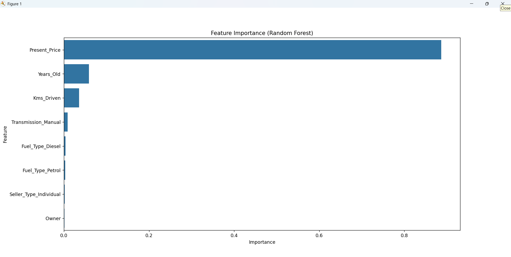

🚗 Car Price Prediction Web App

This project is a Machine Learning + Flask web app that predicts the resale value of a car based on details such as manufacturing year, kilometers driven, fuel type, transmission, and more.

The app uses a trained ML model and provides users with an estimated price range, confidence insights, and a clean web interface.

📌 Features

Predict the selling price of a used car.

User-friendly web interface built with Flask + Tailwind CSS.

Supports additional inputs like mileage, engine capacity, seats, brand name.

Displays expected price range (min–max) for better clarity.

Optional car image upload for a better UI feel.

Mobile-friendly responsive design.

🛠️ Tech Stack

Frontend: HTML, TailwindCSS

Backend: Flask (Python)

Machine Learning: Scikit-Learn (Linear Regression / Random Forest)

Model Storage: Pickle (.pkl file)

📂 Project Structure
Car-Price-Prediction/
│── app.py                # Flask backend
│── car_price_model.pkl   # Trained ML model
│── templates/
│   └── index.html        # Web UI
│── static/               # (Optional: store images, CSS, JS)
│── requirements.txt      # Python dependencies
│── README.md             # Project documentation
│── data.csv              # Training dataset (if included)

⚙️ Installation & Setup
1️⃣ Clone the repo
git clone https://github.com/harshvardhan-sutar/car-price-prediction.git
cd car-price-prediction

2️⃣ Create virtual environment & install dependencies
pip install -r requirements.txt

3️⃣ Run the Flask app
python app.py

4️⃣ Open in browser
http://127.0.0.1:5000/

📊 Sample Input & Output
Input

Car Brand: Hyundai

Year: 2018

Present Price: 7.5 Lakhs

Kms Driven: 40,000

Mileage: 18 kmpl

Engine: 1200 cc

Seats: 5

Fuel Type: Petrol

Transmission: Manual

Owner: 1

Output
Estimated Price: ₹ 5.85 Lakhs  
Expected Range: ₹ 5.26 – ₹ 6.43 Lakhs  
Car Brand: Hyundai  

🚀 Future Improvements

Add interactive charts (Plotly / Chart.js) for visualization.

Enable PDF/CSV download of prediction report.

Add user authentication and a history of predictions.

Train ML model with bigger dataset (include mileage, engine, seats).

Deploy on Heroku / Render / AWS / GCP.

👨‍💻 Author

Harshvardhan Sutar
📧 [your-harshvardhansutar@gmail.com
]
🔗 LinkedIn
 | GitHub

 <video controls src="Timeline 1.mov" title="Demo Video"></video>
 